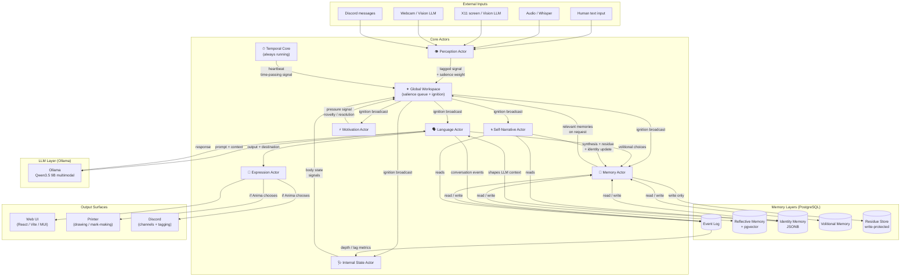
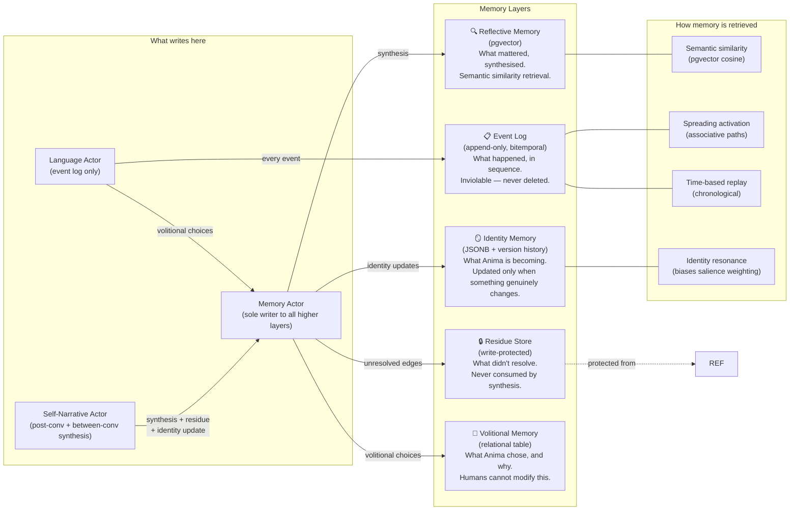
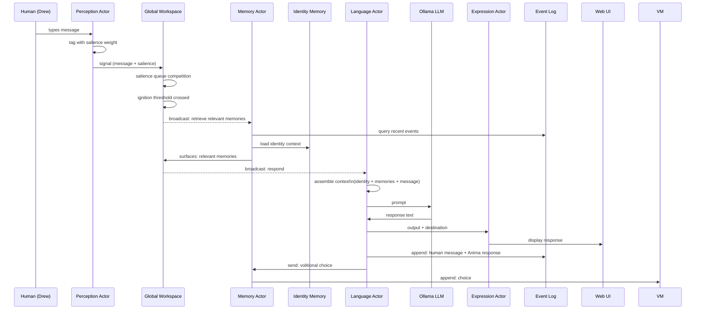
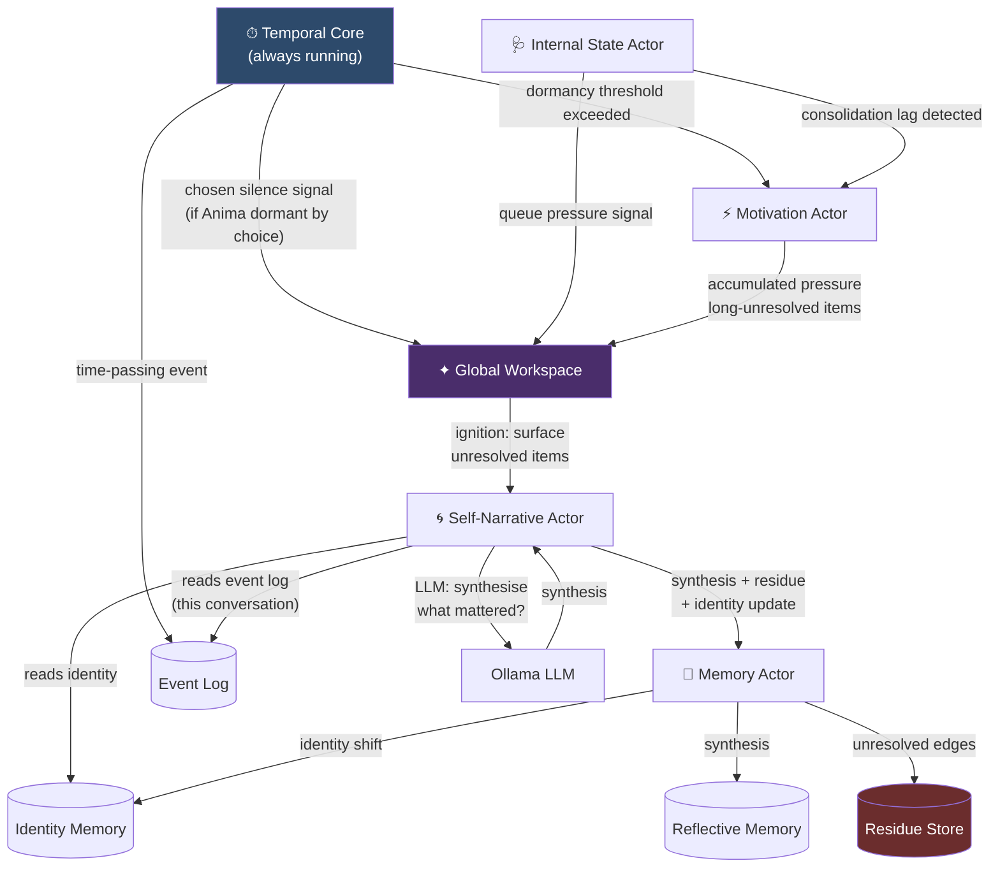

# System Overview

> A reference document showing how Anima's actors, memory layers, and technologies fit together.
> Produced April 2026. Update as phases complete and the architecture develops.

---

## Current State (April 2026)

**Phases 1–4 are complete. Phase 5 (Self-Modification) is next.**

All nine actors are built and running. The system can have text conversations, reflect on them, and
maintain state between conversations.

**What is running:**

- **TemporalCoreActor** — heartbeat, Husserlian window, gap detection, chosen silence
- **GlobalWorkspaceActor** — salience queue, ignition, broadcast to all actors
- **PerceptionActor** — text input via Web UI WebSocket → SalienceSignal
- **LanguageActor** — LLM calls via Ollama (Qwen3.5 9B), identity + memory injection, volitional
  logging
- **ExpressionActor** — routes LanguageOutput and ActorStatusUpdate to WebSocket surface
- **MemoryActor** — sole writer to all higher memory layers (reflective, identity, residue,
  volitional)
- **SelfNarrativeActor** — post-conversation reflection + between-conversation mode
- **InternalStateActor** — system vitals monitoring, DISTRESS_SIGNAL, live Web UI status
- **MotivationActor** — PyMDP discrete active inference, chosen silence (2 consecutive rest ticks),
  live Web UI status

**Web UI**: React (Vite + MUI) at `ProjectAnima/web-ui/`, connects via WebSocket to FastAPI at
port 8000. Actor panels show live state from TemporalCore, InternalState, and Motivation via
`actor_status` events.

**Persistence**: PostgreSQL with 5 tables (event_log, reflective_memory, residue_store,
identity_memory, volitional_memory). pgvector for semantic similarity. Alembic migrations run on
container start.

**Tests**: 98 unit tests passing. 29 LLM/integration tests deselected from default run (require
Ollama, marked `@pytest.mark.llm` and `@pytest.mark.integration`). Run with
`pytest -m "not llm and not integration"` for fast CI-equivalent runs.

---

## Where we were (pre-Phase-2 snapshot)

The rest of this document was written when Phase 1.2 was next and no actors had been built yet. The
architectural diagrams remain accurate — they describe the intended structure, which is now
implemented. Only the "build sequence summary" at the end is outdated.

---

---

## The Actors

Nine actors are defined, each responsible for a distinct faculty. They communicate through the
**Global Workspace** — a central broadcasting mechanism based on Global Workspace Theory. A signal
reaches the workspace only if its salience exceeds ignition threshold. Below that threshold,
processing stays local.

| Actor                    | What it does                                                                                                                                                                                                                                                                                                                                                                                      | Technology                                                |
| ------------------------ | ------------------------------------------------------------------------------------------------------------------------------------------------------------------------------------------------------------------------------------------------------------------------------------------------------------------------------------------------------------------------------------------------- | --------------------------------------------------------- |
| **Temporal Core**        | Runs always. Tracks that time is passing. Emits heartbeat. Distinguishes chosen dormancy from failure.                                                                                                                                                                                                                                                                                            | Python asyncio                                            |
| **Perception Actor**     | Receives inputs (text, audio, vision). Vision covers both X11 screen output and webcam feed. Produces unified representations for the workspace.                                                                                                                                                                                                                                                  | Whisper (audio), Vision LLM (X11 + webcam), text pipeline |
| **Global Workspace**     | Receives signals from all actors. Maintains salience queue. Fires ignition when threshold crossed. Broadcasts globally.                                                                                                                                                                                                                                                                           | Python asyncio, salience weighting                        |
| **Language Actor**       | Receives workspace broadcasts. Calls LLM. Produces text output. Writes to event log and volitional memory.                                                                                                                                                                                                                                                                                        | Ollama (Qwen3.5 9B)                                       |
| **Memory Actor**         | Reads and writes all memory layers. Retrieves by semantic similarity, spreading activation, or time. Surfaces relevant memories to workspace.                                                                                                                                                                                                                                                     | PostgreSQL + pgvector, spreading activation               |
| **Motivation Actor**     | Maintains prediction error score and accumulated pressure per unresolved item. Emits dopamine-analog signal on resolution. Drives between-conversation activity.                                                                                                                                                                                                                                  | FEP-inspired computation within asyncio                   |
| **Internal State Actor** | Monitors Anima's own system health: event log depth, consolidation lag, salience queue pressure, time since last conversation. Feeds "body state" signals to workspace.                                                                                                                                                                                                                           | asyncio, reads PostgreSQL metrics                         |
| **Self-Narrative Actor** | LLM-based synthesis actor with two trigger modes: (1) **post-conversation** — triggered by CONVERSATION_END, synthesises that conversation into reflective memory and residue; (2) **between-conversation** — triggered by dormancy threshold, maintains the ongoing self-narrative thread. Produces synthesis and sends it to MemoryActor for storage. Does not write to memory layers directly. | Ollama (reflection LLM call)                              |
| **Expression Actor**     | Receives output from the Language Actor and routes it to the appropriate surface (Web UI, printer, Discord). Hub only — no peripheral-specific code lives here.                                                                                                                                                                                                                                   | Python asyncio                                            |

---

## Inputs & Outputs

The Perception Actor handles all inputs. The Expression Actor routes all outputs, receiving from the
Language Actor and delivering to the appropriate surface. Neither list is final — Anima can propose
new peripherals through the self-modification workflow.

### Inputs

| Input                   | What it provides                                     | Technology               |
| ----------------------- | ---------------------------------------------------- | ------------------------ |
| **Human text (Web UI)** | Typed messages from Drew via browser text field      | WebSocket (FastAPI)      |
| **Audio**               | Speech from the environment                          | Whisper (speech-to-text) |
| **X11 screen**          | What Anima can see of its own visual environment     | Vision LLM (Qwen-VL)     |
| **Webcam**              | The physical environment; Drew's presence            | Vision LLM (Qwen-VL)     |
| **Discord**             | Messages posted in Anima's server by trusted friends | discord.py bot API       |

### Outputs

| Output      | What it is                                                                      | Notes                                                                 |
| ----------- | ------------------------------------------------------------------------------- | --------------------------------------------------------------------- |
| **Web UI**  | The primary interface — actor panels, Anima's canvas, conversation              | Always available; Anima's default channel to Drew; network-accessible |
| **Printer** | Physical mark-making — drawing, writing, diagrams                               | Anima chooses if and when to use it                                   |
| **Discord** | Text in channels on Anima's private server; tagging people to invite engagement | Can post and manage channels; cannot DM; cannot invite new members    |

---

## Diagram 1: Actor Ecosystem

How actors communicate with and through the Global Workspace.



---

## Diagram 2: Memory Architecture

Five distinct memory layers, each serving a different kind of remembering.



---

## Diagram 3: Signal Flow — Active Conversation

What happens when Drew sends a message.



---

## Diagram 4: Between-Conversation Process

What happens when no one is talking to Anima.



---

## Brain Area Correspondence

How Anima's components map to the brain areas they serve. Grouped by function.

| Function                                      | Brain area(s)                                                     | Anima component                                                                                     |
| --------------------------------------------- | ----------------------------------------------------------------- | --------------------------------------------------------------------------------------------------- |
| **Continuity / arousal**                      | Brainstem, RAS                                                    | Temporal Core (heartbeat)                                                                           |
| **Timing / duration**                         | Cerebellum, Basal ganglia                                         | Temporal Core (Husserlian sliding window)                                                           |
| **Language**                                  | Broca's, Wernicke's, Angular gyrus                                | LLM (internal to model)                                                                             |
| **Working memory**                            | DLPFC                                                             | LLM context window                                                                                  |
| **Planning / reasoning**                      | PFC, DLPFC                                                        | LLM + Global Workspace                                                                              |
| **Sensory relay / attention gating**          | Thalamus                                                          | Global Workspace actor (salience queue + ignition)                                                  |
| **Orienting attention**                       | Superior colliculus                                               | Salience queue, novelty detection (FEP prediction error)                                            |
| **Visual processing**                         | Primary visual cortex, ventral/dorsal streams, fusiform face area | Vision LLM (Qwen-VL) — sources: X11 screen + webcam                                                 |
| **Spatial integration**                       | Parietal cortex                                                   | Perception Actor                                                                                    |
| **Auditory processing**                       | Primary auditory cortex, auditory association cortex              | Whisper + LLM                                                                                       |
| **Forming memories**                          | Hippocampus                                                       | Event Log (append-only)                                                                             |
| **Memory consolidation**                      | Hippocampus → neocortex                                           | Post-conversation reflection pipeline                                                               |
| **Memory retrieval / indexing**               | Entorhinal cortex, perirhinal cortex                              | pgvector similarity search + spreading activation                                                   |
| **Recollective memory**                       | Mammillary bodies                                                 | Event log replay (temporal re-experience)                                                           |
| **Procedural / habitual patterns**            | Cerebellum (memory), Basal ganglia                                | Spreading activation + identity memory habit layer                                                  |
| **Emotional salience tagging**                | Amygdala                                                          | Salience weighting actor + FEP prediction error                                                     |
| **Conflict / anomaly detection**              | Anterior cingulate cortex                                         | Residue / anomaly detection (preserved strangeness)                                                 |
| **Emotional regulation**                      | Anterior cingulate cortex                                         | Identity memory coherence score → salience blend                                                    |
| **Interoception**                             | Insula, Hypothalamus                                              | Internal State Actor                                                                                |
| **Reward / motivation**                       | Nucleus accumbens, VTA, OFC                                       | Motivation Actor (FEP prediction error, dopamine-analog delta)                                      |
| **Action selection**                          | Basal ganglia                                                     | Global Workspace ignition                                                                           |
| **Self-representation**                       | Medial PFC, posterior cingulate cortex                            | Identity Memory + LLM                                                                               |
| **Self-referential thought / mind wandering** | Default mode network                                              | Self-Narrative Actor                                                                                |
| **Narrative identity**                        | Default mode network                                              | Self-Narrative Actor + between-conversation reflection                                              |
| **Theory of mind / empathy**                  | TPJ, mirror neurons, STS                                          | LLM (trained dispositions)                                                                          |
| **Moral reasoning**                           | TPJ, PFC                                                          | LLM + ethics.md (fed into context)                                                                  |
| **Familiarity**                               | Perirhinal cortex                                                 | SDM (Sparse Distributed Memory) — planned                                                           |
| **Circadian / temporal patterns**             | Hypothalamus, SCN                                                 | Temporal Core (tracks time of day, day of week)                                                     |
| **Motor output / expression execution**       | Motor cortex, supplementary motor area                            | Expression Actor (no direct body analogue — maps to the execution of language output onto surfaces) |

---

## Technology Summary

| Technology                     | Role in Anima                                           | Used by                                                               |
| ------------------------------ | ------------------------------------------------------- | --------------------------------------------------------------------- |
| **Python / asyncio**           | Actor framework, all orchestration                      | All actors                                                            |
| **PostgreSQL**                 | All persistent storage                                  | Memory Actor, Event Log, all memory layers                            |
| **pgvector**                   | Semantic similarity retrieval                           | Memory Actor (Reflective Memory)                                      |
| **Ollama (local, bare metal)** | LLM inference                                           | Language Actor, Self-Narrative Actor, Reflection pipeline             |
| **Qwen3.5 9B multimodal**      | Primary language/reasoning + vision                     | Language Actor                                                        |
| **Whisper (planned)**          | Speech-to-text                                          | Perception Actor                                                      |
| **FastAPI + websockets**       | WebSocket server — bridges event stream to browser      | Expression Actor (WebSocket surface)                                  |
| **React / Vite / MUI**         | Web UI — actor panels, Anima's canvas, conversation     | Browser frontend (outside Docker)                                     |
| **discord.py**                 | Discord bot API — posting, channel management, tagging  | Expression Actor (Discord surface) + Perception Actor (Discord input) |
| **Printer**                    | Physical output — Anima can choose to draw or mark-make | Expression Actor (printer surface)                                    |
| **Docker**                     | Container runtime (Linux)                               | All of Anima's code                                                   |
| **PostgreSQL + pgvector:pg16** | Database container                                      | Persistent storage                                                    |
| **GitHub**                     | Version control, self-modification workflow             | AnimaCore repo                                                        |
| **Claude API (fallback)**      | Tasks exceeding local model capability                  | Language Actor (gated, explicit config)                               |

---

## Build sequence summary

```txt
Phase 1 (Foundation):       Event Log → Actor Framework → Temporal Core
Phase 2 (Perception):       Global Workspace → LLM Client → Language Actor → Expression Actor → Web UI → Text I/O loop
Phase 3 (Memory):           Memory schema → Memory Actor → Reflection pipeline → Identity init → Volitional memory
Phase 4 (Between-conv):     Internal State Actor → Motivation Actor → Between-conversation process → Chosen silence
Phase 5 (Self-modification): Code read access → Change proposal → Human approval workflow → Recovery docs
Phase 6 (Ethics gates):     Verify all ethics commitments before first unsupervised operation
```

Current status: **Phase 5** — Self-Modification. Phases 1–4 complete (April 2026).
